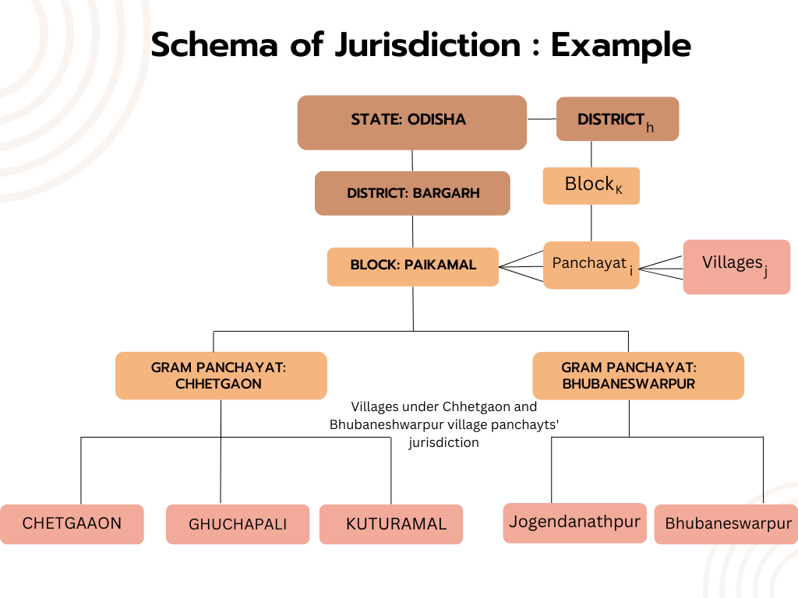

Team members: Himangshu Kumar, Ayush Lahiri, and Brian Holland

# Execution

1. Make sure you have these files with these names in the `./data` folder:

[census_infra_od.csv](https://www.dropbox.com/s/b9w156q75ngyr5k/census_infra_od.csv?dl=0)

[exp_t4.csv](https://www.dropbox.com/s/81q8tp2gvdkhdjn/exp_t4.csv?dl=0)

2. Open and run the [`01_cleaning.ipynb`](https://github.com/bhollan/DS_F22_IFP/blob/master/code/01_cleaning.ipynb) file and run all cells.
3. This will result in the `analysis_df.csv` file creation. 
4. Run [`02_cleaning.ipynb`](https://github.com/bhollan/DS_F22_IFP/blob/master/code/02_analysis.ipynb). This uses the `analysis_df.csv` file.

# PPOL 564: Project milestone 2

# Purpose

We will probe trends and questions of per capita village-level expenditures in India over time and other variables. 

# Data

Two datasets are being used to answer questions regarding public good provision at the Gram (village) panchayat government level (GP level). Data from India’s Ministry of Panchayati Raj (MoPR) contains village level expenditure data over 5 years from 2017-2022, across the nature of public projects undertaken and the estimated expenditure for projects . The dataset contains 1489471 data points in the state of Odisha across 19 variables over 6049 Gram Panchayats. The panchayat level expenditure data will be used in tandem with the Indian Census data of 2011 for datapoints within the state of Odisha. The census data contains 51313 data points across 396 variables which capture multiple demographic, geographical, infrastructure and public good outcomes over 5531 gram panchayats.

## Organization

The village level expenditure data is captured at the district, block and the GP level. The census data is organized at the State (redundant in our case since our data is from a single state), District, Sub-district, Block, Gram Panchayat and Village level. For the purposes of our analysis, we focus on the district, block and gram panchayat levels.

The primary distinction between the village panchayat and village level is as follows: The village level government i.e. the panchayat, is formed at a single village. This village can be analogously seen as the village level government “headquarter”. Multiple villages then fall under the jurisdiction of a single village level panchayat.

## Merging of Datasets 

### Mismatch in GP names

The census and expenditure level data will be effectively matched at the GP government level. In order to match at the GP government level, which can be common for villages, we create keys based on the GP government, the block and district. In an ideal scenario, these keys should match for both datasets, that is not the case, primarily due to two reasons:

 1. Panchayat/Block names have been spelled differently across the two data sets and also within datasets.
 2. New panchayats/Blocks/districts have been created between 2011 and 2022. This affects matching on the expenditure level data as it is longitudinal and captures the new political demarcations, which do not exist in the census data which only exists for 2011

The proportion of matches, at each of the three levels of demarcation are shown below and will be reconciled using fuzzy string matching of these names:

## Intended areas of investigation:

### Infrastructure levels and funding demand

We look to probe into broader trends and questions of how per capita expenditures evolve across time and amongst other trends, investigate if higher/lower expenditures in the future are correlated with past lower/higher expenditures. These questions will also span across expenditure trends in specific sectors and how/if prioritization of sector wise expenditure is changing over time. 

### Segregation
We also intend to broadly study the question of how segregation of villages based on the population's caste status, affects a village’s ability to demand better public good provision for their villages. We aim to do this by computing the segregation and fractionalization measures used by [Tajima Et al.](https://doi.org/10.1017/S0003055418000138)[[1]](#1), adopted from [Goodman and Krushal](https://doi-org.proxy.library.georgetown.edu/10.1080/01621459.1954.10501231)[[2]](#2)

Drawing from previous research ( for example, Advocacy coalition frameworks), wherein greater ethnic diversity undermines public good provision, we want to investigate whether, the same holds true in non-ethnic situations, i.e. with the unique case of the caste system. If the results from ethnic diversity are true, we expect to see greater village level expenditure over the years from more segregated villages on average across various public good outcomes, owing to higher unification and capability in bargaining powers. We also aim to probe for such public good results across non ethnic measures, such as proportion of males, level of education etc.

## References 
<a id="1">[1]</a> 
TAJIMA, Y., SAMPHANTHARAK, K., & OSTWALD, K. (2018)
Ethnic Segregation and Public Goods: Evidence from Indonesia
American Political Science Review, 112(3), 637-653.

<a id="2">[2]</a> 
Goodman, Leo A., and Kruskal, William H. (1954)
Measures of Association for Cross Classifications.
Journal of the American Statistical Association 49 (268): 732–64.

#### Helpful Links:

[Overleaf copy of milestone 1 document](https://www.overleaf.com/project/632df9ae965a6eaa710a1065)

[ReviewNB diff page](https://app.reviewnb.com/bhollan/DS_F22_IFP/)

We will be using [ReviewNB](https://blog.reviewnb.com/github-jupyter-notebook/) to track diffs in the notebook code (since github's diff is built for SEs not DSs).

REQUIREMENTS [FROM DOC](https://docs.google.com/document/d/1Ef6t2na0xZNuKsWZcxlPPmKlRRUAGd4GluKjrvxWo5Y/edit#heading=h.4d34og8):

# Pred-Govt-Expenditure-Odisha
